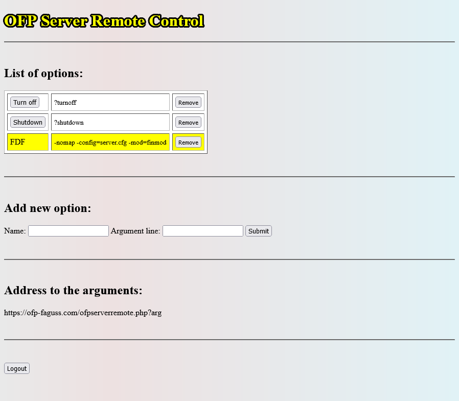
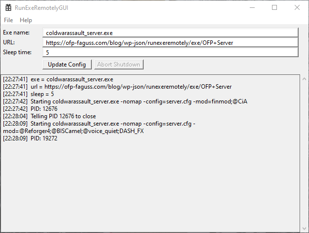

# RunExeRemotely
RunExeRemotely is a simple program for starting/restarting selected program with wanted arguments from a website panel. It was made for OFP/ARMA dedicated server but it could be used with any other executable.

It downloads data every couple of seconds. If the data has changed then it closes the selected executable and starts a new instance of it with the downloaded new argument line. Optionally it can also shutdown the system. Multiple instances of RunExeRemotely can be run but they have to be in separate directories.

# Usage

1. Download [binary](https://github.com/Faguss/RunExeRemotely/releases)
2. Copy RunExeRemotelyGUI.exe to the directory with the program you want to control
3. You can use either standalone PHP script or a Wordpress plugin

### Standalone PHP script

* Open ofpserverremote.php in a text editor and modify define "path_to_password_file" so that it's stored in a non-public folder. Alternatively setup .htaccess to block access to this file
* Upload ofpserverremote.php to your web server and then open it in a browser
* Set new password and then login with it
* Below "Add new option" type in option name, arguments for the executable and click on the "Submit"
* Under "List of options" click on the button with that option name
* Copy address to the arguments

  <kbd></kbd>

### Wordpress plugin

* Upload "runexeremotely" folder to the wp-content/plugins in your Wordpress installation
* Log in to your admin panel. Go to "Plugins"
* Find "RunExeRemotely" in the plugin list. Activate it
* On the left sidebar option "Run Exe Remotely" will appear. Move the cursor over it and then click on "Options - Edit"
* Type in title, arguments for the executable and then click on "Save"
* Select "Executables - Edit" from the sidebar
* Type in title and then select the option you just added. Click on "Save"
* On the top there's a button "Link to data". Right-click on it and select "Copy Link"

  <kbd></kbd>

### Usage - cont.

4. Launch RunExeRemotelyGUI.exe
5. Change "Exe name" to the name of the program you want to control
6. Below paste URL from the standalone script or Wordpress plugin
7. Click on the "Update Config" button
8. Setup is done! Now you can restart your selected program by activating a different option on the website

  <kbd></kbd>

# Compiling

Program was made with Microsoft Visual Studio Community 2022 version 17.8.6

1. Open RunExeRemotely.sln in VS
2. Select project RunExeRemotelyGUI
3. Set active configuration to Release x86
4. Select Build --> Build RunExeRemotelyGUI
