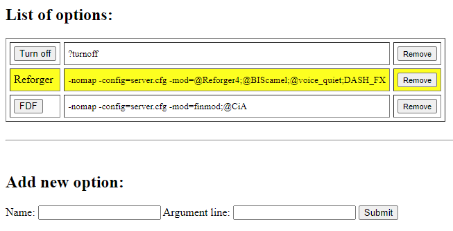
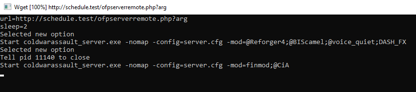

# RunExeRemotely
Very simple solution for controlling OFP server remotely but could also be used for any other executable.

Program uses wget to download data every couple of seconds. If the data has changed then it closes the server and starts a new instance with the new argument line.

There's also a very simple PHP script for storing and serving data. Program expects plain text argument line so you can easily replace the PHP script with your own web interface.

Program was compiled using Microsoft Visual Studio Community 2022 Version 17.5.4

## Screenshots

<p align="center">
  <kbd></kbd>
</p>

<p align="center">
  <kbd></kbd>
</p>

## Instructions
1. Download [binary](https://github.com/Faguss/RunExeRemotely/releases)
2. Open ofpserverremote.php in a text editor and add your IP address to ADMIN_IP
3. Upload ofpserverremote.php to your web server
4. Open ofpserverremote.php in a web browser and add new data
5. Copy RunExeRemotely.exe and wget.exe to the game directory
6. Run RunExeRemotely.exe with url option pointing to the PHP script but with added "?arg" at the end

### Options

1. Options can be passed as arguments:

```
RunExeRemotely.exe -url=https://example.com/ofpserverremote.php?arg -exe=arma3server_x64.exe -sleep=10
```

2. Or create RunExeRemotely.cfg file and write them there:

```
url=https://example.com/ofpserverremote.php?arg
exe=arma3server_x64.exe
sleep=10
```

There are three options:

- `url` - address from which program downloads data
- `exe` - executable name to run. Default is `coldwarassault_server.exe`
- `sleep` - pause time in seconds. Default is 5